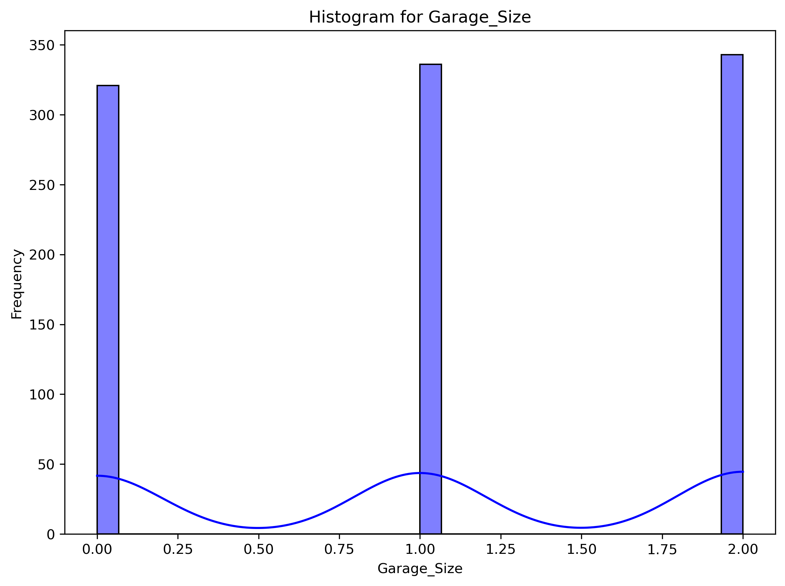

# HousePrice Regression Project

This project predicts house prices using various regression techniques and provides tools for data analysis and visualization.

## Table of Contents

1. [Project Overview](#project-overview)
2. [Directory Structure](#directory-structure)
3. [Key Features](#key-features)
4. [Installation](#installation)
5. [Usage](#usage)
   - [Data Preprocessing and EDA](#data-preprocessing-and-eda)
   - [Model Training and Evaluation](#model-training-and-evaluation)
6. [Results](#results)
7. [Dependencies](#dependencies)
8. [License](#license)

## Project Overview

This repository provides a complete pipeline for:
- Exploratory Data Analysis (EDA)
- Preprocessing house price data
- Training regression models (Linear Regression, Random Forest, and XGBoost)
- Evaluating models and generating visualizations

## Directory Structure

```
HousePrice/
├── data/
│   ├── cleaned_dataset.csv
│   ├── house_price_regression_dataset.csv
├── eda/
│   ├── *.png
├── results/
│   ├── metrics.json
│   ├── *.png
├── eda.py
├── train_test.py
├── README.md
```

## Key Features

- **EDA**: Correlation matrices, histograms, and boxplots for understanding data distribution.
- **Data Cleaning**: Removes duplicates and performs scaling.
- **Regression Models**: Linear Regression, Random Forest, and XGBoost with hyperparameter tuning.
- **Evaluation**: Generates metrics (MSE, RMSE, R², etc.) and visualization plots.

## Installation

1. Clone the repository:
   ```bash
   git clone https://github.com/Belladonna03/HousePrice.git
   cd HousePrice
   ```
2. Install the required Python packages:
   ```bash
   pip install -r requirements.txt
   ```

## Usage

### Data Preprocessing and EDA

Run the `eda.py` script to preprocess the data and perform EDA:
```bash
python eda.py
```
Output:
- Cleaned dataset saved in `data/cleaned_dataset.csv`
- Visualizations saved in the `eda/` directory

### Model Training and Evaluation

Run the `train_test.py` script to train models and generate results:
```bash
python train_test.py
```
Output:
- Model predictions and residuals saved as plots in the `results/` directory
- Metrics saved in `results/metrics.json`

## Results

### Examples of EDA Visualizations

1. **Correlation Matrix Before Preprocessing**  
   

2. **Histogram for Garage Size**  
   

### Examples of XGBoost Visualizations

1. **Actual vs Predicted Values**  
   

2. **Feature Importance**  
   

Metrics file (`results/metrics.json`) includes performance metrics for all models.

## License

This project is licensed under the MIT License. See the [LICENSE](LICENSE) file for details.
